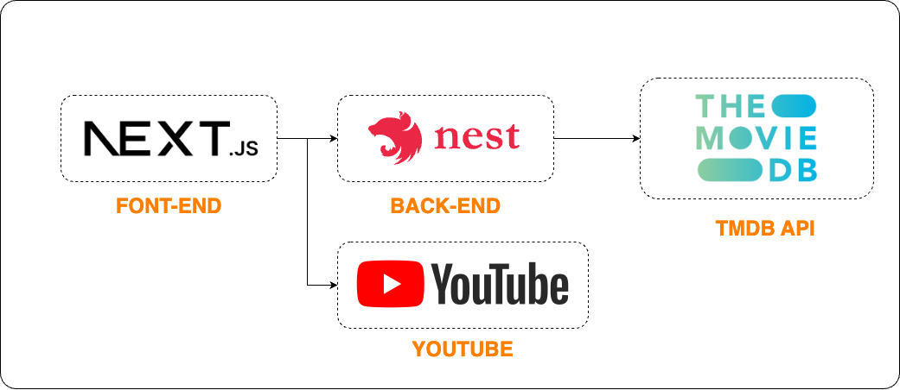

# Nextflix Web Application

## Overview
Nextflix Web Application เป็นระบบที่ออกแบบมาเพื่อให้ผู้ใช้สามารถสำรวจและค้นหาข้อมูลเกี่ยวกับภาพยนตร์และรายการทีวีได้ โดยใช้เทคโนโลยี Next.js สำหรับฝั่ง Frontend และ Nest.js สำหรับ Backend

ทั้งสองส่วนของระบบถูก deploy ด้วย Vercel เพื่อให้สามารถใช้งานได้อย่างสะดวกและรวดเร็ว

## Architecture



โปรเจกต์นี้ใช้สถาปัตยกรรมแบบ **Next.js (Frontend) + Nest.js (Backend)** โดยที่ Frontend ซึ่งพัฒนาด้วย Next.js จะเป็นตัวแสดงผลและรับคำขอจากผู้ใช้ เมื่อผู้ใช้ร้องขอข้อมูล เช่น รายการภาพยนตร์หรือรายละเอียดภาพยนตร์ Next.js จะส่งคำขอไปยัง Backend ซึ่งพัฒนาด้วย Nest.js เพื่อประมวลผล นอกจากนี้ Frontend ยังสามารถเชื่อมต่อกับ **YouTube** เพื่อดึงตัวอย่างภาพยนตร์หรือวิดีโอที่เกี่ยวข้องมาแสดงบนแพลตฟอร์ม

Backend จะทำหน้าที่เป็นตัวกลางในการดึงข้อมูลจากแหล่งข้อมูลภายนอก โดยเชื่อมต่อกับ **The Movie Database API (TMDb)** เพื่อดึงข้อมูลเกี่ยวกับภาพยนตร์ รายการทีวี และความนิยมของแต่ละเนื้อหา 

## Features
- ✅ **Home Page**
- ✅ **TV Shows**
- ✅ **Movies**
- ✅ **New & Popular**
  - 🔥 **Popular Movies**
  - 📺 **Popular TV Shows**
  - 🎬 **Upcoming Movies**
- ✅ **Movie Detail Page**

### Additional Features
- 🌗 **Light/Dark Theme Support**
- 🌍 **Localization (i18n)**

## Installation
### Environment Variables
#### Backend (`nextflix-backend/.env`)
```sh
TMDB_BEARER_TOKEN=
TMDB_BASE_URL=
```

#### Frontend (`nextflix-frontend/.env`)
```sh
NEXT_PUBLIC_API_HOST=
```

### Prerequisites
- [ ] ติดตั้ง `Node.js` (แนะนำให้ใช้เวอร์ชันล่าสุด LTS)

### Steps
1. Clone Repository
   ```sh
   git clone https://github.com/your-repo/nextflix-web-application.git
   cd nextflix-web-application
   ```
2. ติดตั้ง Dependencies
   ```sh
   cd nextflix-frontend
   pnpm install  # ติดตั้ง dependencies สำหรับ Frontend
   cd ../nextflix-backend
   pnpm install  # ติดตั้ง dependencies สำหรับ Backend
   ```
3. ลงชื่อเข้าใช้ [TMDb Developer Portal](https://developer.themoviedb.org) และคัดลอก **Bearer Token**
4. นำ **Bearer Token** ไปใส่ในไฟล์ `nextflix-backend/.env` โดยเพิ่มบรรทัดนี้:
   ```sh
   TMDB_BEARER_TOKEN=your_token_here
   ```
5. รันโปรเจกต์
   ```sh
   cd nextflix-frontend
   pnpm run dev  # รัน Frontend (Next.js)
   cd ../nextflix-backend
   pnpm run start:dev  # รัน Backend (Nest.js)
   ```

